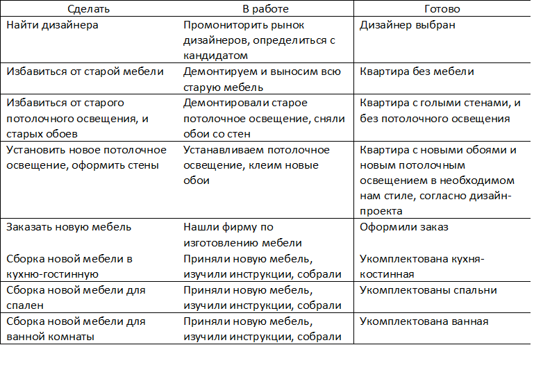

***Кейс:***
У вас есть трёхкомнатная квартира, в которой не было ремонта последние 20 лет. Вместе с друзьями вы хотите сделать в ней современный ремонт, выстроив работу по Scrum.
Опишите, как вы организуете работу над проектом по фреймворку Scrum. Сформируйте Product Backlog. Разделите все работы на спринты. Сформируйте Sprint Backlog одного любого спринта. Нарисуйте Scrum-доску и покажите на ней, как организована работа над задачами этого спринта.

***Решение:***
Product Backlog.
Сделать ремонт квартиры в стиле неоклассика с мебелью, в постельных тонах. В квартире имеется вся необходимая бытовая техника.
Кухня-гостинная: Имеется обеденный стол на 8 человек, кухонный гарнитур, холодильник, панарамное окно, мелкая бытовая техника, также присутствует диван.
Спальня1: Двуспальная кровать, две прикроватные тумбы и платяной шкаф, окно.
Спальня2: Диван, шкаф, туалетный столик, стул, окно.
Ванная комната: Душевая кабина, раковина и инсталяция, стиральная машина, полотенцесушитель, настенное зеркало.

Процесс работы по Scrum:
Первый спринт (1 день): Мониторим рынок дизайнеров. Выбираем дизайнера. Делаем дизайн - проект квартиры.
Второй спринт (2 дня): Демонтируем и выносим всю старую мебель. В конце каждого дня проводим daily meeting. По завершению спринта делаем ретроспективу. Первый инкремент - квартира без мебели.

Третий спринт (3 дня): Снимаем потолочное освещение, снимаем со стен обои. В конце каждого дня проводим daily meeting. По завершению спринта делаем ретроспективу. Инкремент - голые стены.

Четвертый спринт (3 дня): Согласно дизайн-проекта, устанавливаем новое потолочное освещение, и оформляем стены (поклейка обоев). В конце каждого дня проводим daily meeting. По завершению спринта делаем ретроспективу. Инкремент - новые обои и потолочное освещение в выбранном нами стиле.

Пятый спринт (1 день): Оформляем заказ на новую мебель.

Шестой спринт (5 дней): Получаем мебель для кухни-гостинной и собираем ее, и делаем расстановку, согласно дизайн-проекта. В конце каждого дня проводим daily meeting. По завершению спринта делаем ретроспективу. Инкремент - укомплектованная кухня-гостинная.

Седьмой спринт (5 дней): Получаем мебель для спален, собираем ее, и делаем расстановку согласно дизайн-проекта. В конце каждого дня проводим daily meeting. По завершению спринта делаем ретроспективу. Инкремент - укомплектованные спальни.

Восьмой спринт (5 дней): Получаем мебель для ванной комнаты, собираем ее, устанавливаем согласно дизайн-проекта. В конце каждого дня проводим daily meeting. По завершению спринта делаем ретроспективу. Инкремент - укомплектованная ванная комната.

Задача выполнена.

Scrum-доска:

